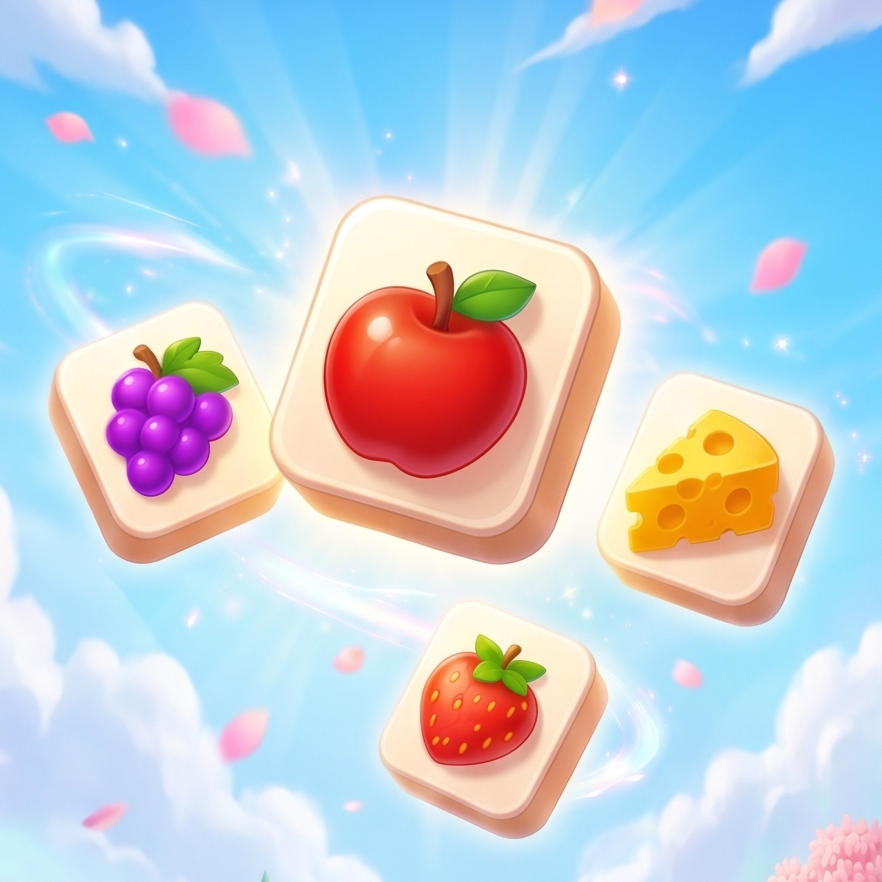
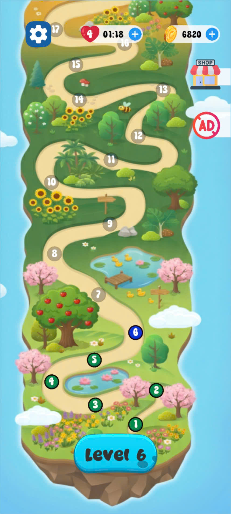
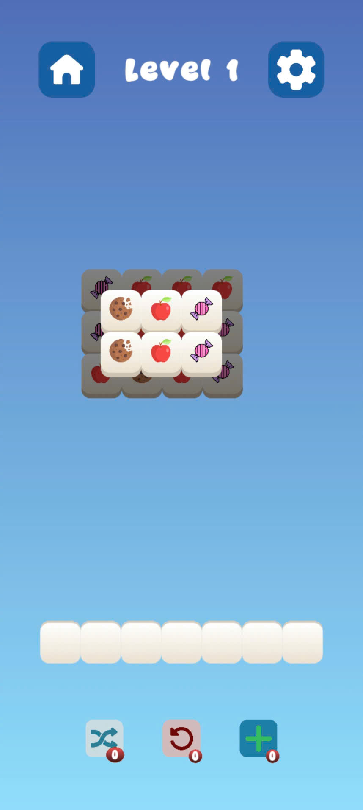
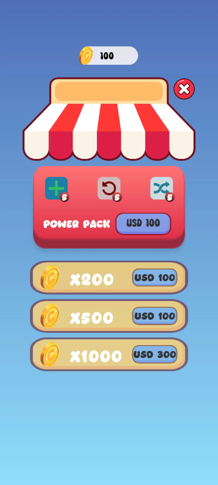
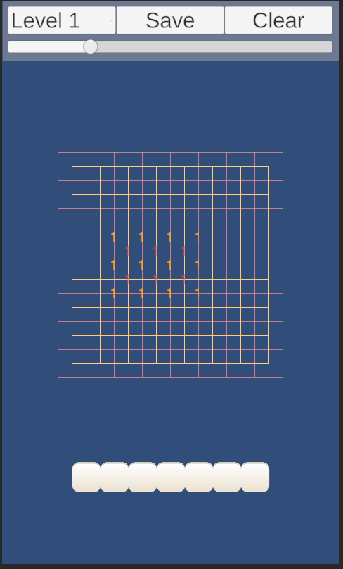
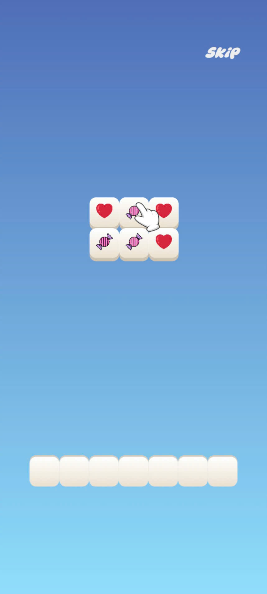

<p align="center">
  
</p>
<h1 align="center">Tile Match</h1>

> ## 📖 About the Project
>**Tile Match** is a casual puzzle game for Android where players match identical tiles to clear the board and complete level objectives.
>This project was developed as a full-cycle Unity game production exercise, focusing on both gameplay implementation and software architecture. The goal was not only to create an engaging puzzle experience but also to practice building a maintainable and scalable game codebase.


## Video Demo
https://github.com/user-attachments/assets/66800e05-36b1-4ab3-8234-415f10193dc4

## Screenshots
<table align="center">
  <tr>
    <td align="center"><b>Map</b></td>
    <td align="center"><b>Gameplay</b></td>
    <td align="center"><b>Store</b></td>
    <td align="center"><b>Setup Scene</b></td>
    <td align="center"><b>Tutorial</b></td>
  </tr>
  <tr>
    <td></td>
    <td></td>
    <td></td>
    <td></td>
    <td></td>
  </tr>
</table>

## Technical Highlights

### Architecture

- Event Bus communication system
- Modular UI architecture
- Singleton-based manager system
- ScriptableObject data configuration

### Gameplay Systems

- Grid generation system
- Tile matching logic
- Hint generation algorithm
- Level completion detection

### Optimization

- Object pooling
- Cached component references
- Efficient event-driven updates

### Save System

- JSON serialization
- Persistent player progress
- Level unlock management

---

### Design Patterns

- Singleton Pattern
- Observer Pattern
- Event Bus Pattern

## Project Structure

```text
Assets
│
├── _Scripts
│   ├── Core
│   │   ├── Grid
│   │   ├── Tile
│   │   └── Slot
│   │
│   ├── Managers
│   │   ├── GameManager
│   │   ├── LevelManager
│   │   └── SceneLevelManager
│   │
│   ├── UI
│   │   ├── Home
│   │   ├── Settings
│   │   ├── Loading
│   │   └── Popup
│   │
│   ├── SaveSystem
│   ├── Data
│   └── Utils
│
├── Sprites
├── Resources
├── Scenes
└── Fonts
```

---
## Download

Latest **[Releases](https://github.com/DKxai/Tile-Match/releases)**.
